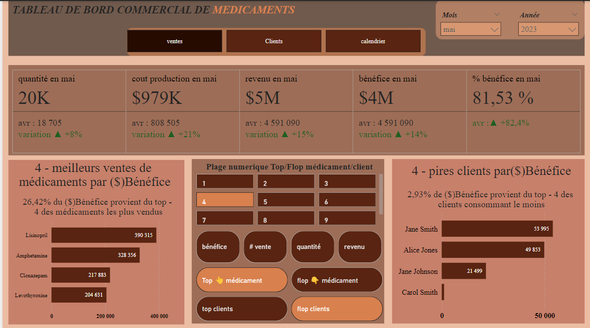
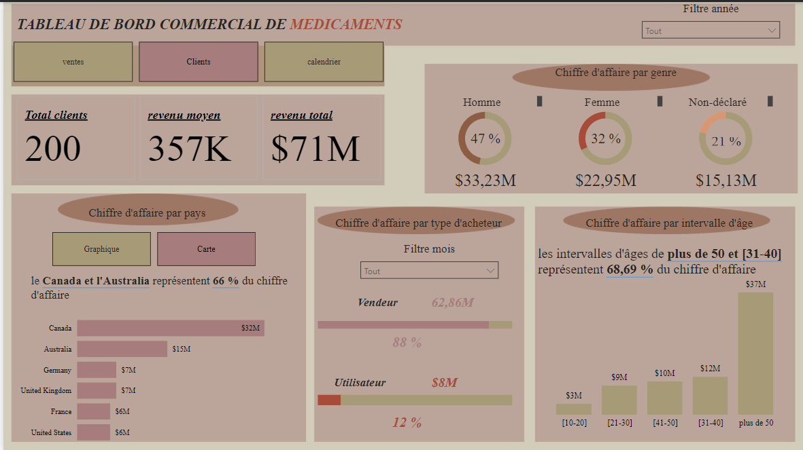
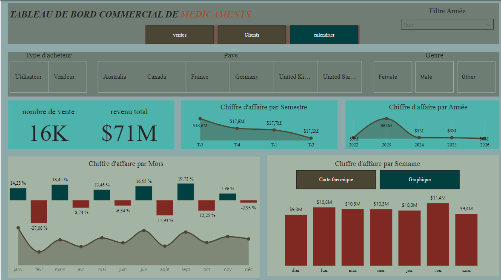

# Report on Pharmaceutical Marketing / Rapport sur la Commercialisation des Médicaments

The Report is divided into three pages, offering a comprehensive analysis of sales and performance metrics. The first page highlights key metrics such as quantity, production cost, revenue, profit, and profit margin, along with the top N best and worst-performing drugs and clients based on profit, sales, revenue, and quantity. The second page provides insights into total clients, average client revenue, total revenue, and revenue distribution by buyer type, gender, country, and age intervals. The third page focuses on segments, client types, countries, and gender, displaying metrics such as sales count, revenue by semester and year, as well as monthly and weekly revenue trends and distributions.

Le Rapport de bord est divisé en trois pages, offrant une analyse complète des ventes et des performances. La première page met en évidence des métriques clés telles que la quantité, le coût de production, le revenu, le bénéfice et la marge bénéficiaire, ainsi que le top N des meilleurs et pires médicaments et clients en fonction du bénéfice, des ventes, du revenu et de la quantité. La deuxième page fournit des informations sur le nombre total de clients, le revenu moyen par client, le revenu total et la répartition du chiffre d'affaires par type d'acheteur, genre, pays et tranches d'âge. La troisième page se concentre sur les segments, les types de clients, les pays et les genres, affichant des métriques telles que le nombre de ventes, le chiffre d'affaires par semestre et par année, ainsi que les tendances et distributions du chiffre d'affaires par mois et jour de la semaine.

*ventes*

*clients*

*calendrier*
